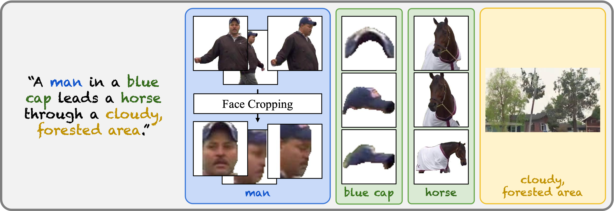

# ⚗️ VideoAlchemy
This is the offical Github repository of VideoAlchemy.

**[VideoAlchemy: Open-set Personalization in Video Generation](https://snap-research.github.io/VideoAlchemy)**
</br>
[Tsai-Shien Chen](https://tsaishien-chen.github.io/),
[Aliaksandr Siarohin](https://aliaksandrsiarohin.github.io/aliaksandr-siarohin-website/),
[Willi Menapace](https://www.willimenapace.com/),
[Yuwei Fang](https://yuwfan.github.io/),
[Kwot Sin Lee](https://www.linkedin.com/in/kwotsin/),
[Ivan Skorokhodov](https://skor.sh/),
[Kfir Aberman](https://kfiraberman.github.io/),
[Jun-Yan Zhu](https://www.cs.cmu.edu/~junyanz/),
[Ming-Hsuan Yang](https://faculty.ucmerced.edu/mhyang/),
[Sergey Tulyakov](http://www.stulyakov.com/)
</br>

[](https://arxiv.org/abs/2412.xxxxx)
[](https://snap-research.github.io/VideoAlchemy)

# Introduction
We introduce *MSRVTT-Personalization*, a new benchmark for the task of personalization. It aims at accurate subject fidelity assessment and supports various conditioning modes, including conditioning on face crops, conditioning on single or multiple arbitrary subjects, and conditioning on foreground objects and background.

We include the testing dataset and evaluation protocol in this repository. We show a test sample of *MSRVTT-Personalization* below:
<table class="center">
  <tr>
    <td width=38% style="border: none"></td>
    <td width=62% style="border: none"></td>
  </tr>
  <tr style="text-align: center;">
    <td width=38% style="border: none">Ground Truth Video</td>
    <td width=62% style="border: none">Personalization Annotations</td>
  </tr>
</table>
<sup>**We will remove video samples from Github / project webpage / technical presentation as long as you need it. Please contact tsaishienchen at gmail dot com for the request.</sup>

# Leaderboard
- *MSRVTT-Personalization* evaluates a model across six metrics:
  - Text similarity (Text-S)
  - Video similarity (Vid-S)
  - Subject similarity (Subj-S)
  - Face similarity (Face-S)
  - Dynamic degree (Dync-D)
  - Temporal consistency (T-Cons)

- Quantitative evaluation:
  - Subject mode of *MSRVTT-Personalization* (inputs an entire subject image as the condition)
    | Method | Text-S | Vid-S | Subj-S | Dync-D | T-Cons |
    |--------|--------|-------|--------|--------|--------|
    | [ELITE](https://github.com/csyxwei/ELITE)            | 0.245     | 0.620     | 0.359     | -         | -         |
    | [VideoBooth](https://github.com/Vchitect/VideoBooth) | 0.222     | 0.612     | 0.395     | 0.448     | 0.963     |
    | [DreamVideo](https://github.com/ali-vilab/VGen)      | 0.261     | 0.611     | 0.310     | 0.311     | 0.956     |
    | *VideoAlchemy*                                       | **0.269** | **0.732** | **0.617** | **0.466** | **0.993** |

  - Face mode of *MSRVTT-Personalization* (inputs a face crop image as the condition)
    | Method | Text-S | Vid-S | Face-S | Dync-D | T-Cons |
    |--------|--------|-------|--------|--------|--------|
    | [IP-Adapter](https://github.com/tencent-ailab/IP-Adapter) | 0.251     | 0.648     | 0.269     | -         | -         |
    | [PhotoMaker](https://github.com/TencentARC/PhotoMaker)    | **0.278** | 0.569     | 0.189     | -         | -         |
    | [Magic-Me](https://github.com/Zhen-Dong/Magic-Me)         | 0.251     | 0.602     | 0.135     | 0.418     | 0.974     |
    | *VideoAlchemy*                                            | 0.273     | **0.687** | **0.382** | **0.424** | **0.994** |

- Qualitative evaluation:
  - Subject mode of *MSRVTT-Personalization*
    <table class="center">
      <tr>
        <td width=100% colspan=5 style="border: none"></td>
      </tr>
      <tr style="text-align: center;">
        <td width=15.9%  style="border: none"></td>
        <td width=15.9%  style="border: none"></td>
        <td width=15.9%  style="border: none"></td>
        <td width=28.25% style="border: none"></td>
        <td width=21.2%  style="border: none"></td>
      </tr>
      <tr style="text-align: center;">
        <td width=15.9%  style="border: none"><a href="https://github.com/csyxwei/ELITE">ELITE</a></td>
        <td width=15.9%  style="border: none"><a href="https://github.com/Vchitect/VideoBooth">VideoBooth</a></td>
        <td width=15.9%  style="border: none"><a href="https://github.com/ali-vilab/VGen">DreamVideo</a></td>
        <td width=28.25% style="border: none"><em>VideoAlchemy</em></td>
        <td width=21.2%  style="border: none">Ground Truth</td>
      </tr>
    </table>

  - Face mode of *MSRVTT-Personalization*
    <table class="center">
      <tr>
        <td width=100% colspan=5 style="border: none"></td>
      </tr>
      <tr style="text-align: center;">
        <td width=23.62% style="border: none"></td>
        <td width=13.3%  style="border: none"></td>
        <td width=13.3%  style="border: none"></td>
        <td width=23.62% style="border: none"></td>
        <td width=23.62% style="border: none"></td>
      </tr>
      <tr style="text-align: center;">
        <td width=23.62% style="border: none"><a href="https://github.com/tencent-ailab/IP-Adapter">IP-Adapter</a></td>
        <td width=13.3%  style="border: none"><a href="https://github.com/TencentARC/PhotoMaker">PhotoMaker</a></td>
        <td width=13.3%  style="border: none"><a href="https://github.com/Zhen-Dong/Magic-Me">Magic-Me</a></td>
        <td width=23.62% style="border: none"><em>VideoAlchemy</em></td>
        <td width=23.62% style="border: none">Ground Truth</td>
      </tr>
    </table>

# Evaluation Protocol
### Table of Contents
- [Step 1: Download videos and annotations](#step1)
- [Step 2: Download model checkpoints](#step2)
- [Step 3: Build environments](#step3)
- [Step 4: Prepare *MSRVTT-Personalization* dataset ](#step4)
- [Step 5: Generate videos and collect ground truth embeddings (optional)](#step5)
- [Step 6: Run evaluation](#step6)

### Get started
```
git clone https://github.com/snap-research/VideoAlchemy.git
cd VideoAlchemy
```

<a name="step1"></a>
### Step 1: Download videos and annotations
- Download videos of original [MSR-VTT](https://www.microsoft.com/en-us/research/publication/msr-vtt-a-large-video-description-dataset-for-bridging-video-and-language/)
```
cd msrvtt_personalization
wget https://www.robots.ox.ac.uk/~maxbain/frozen-in-time/data/MSRVTT.zip
unzip MSRVTT.zip
mkdir msrvtt_videos
mv MSRVTT/videos/all/video*.mp4 msrvtt_videos
rm -r MSRVTT MSRVTT.zip
```
- Download annotations of *MSRVTT-Personalization*
```
# Manually download
# https://drive.google.com/file/d/1LPPvXRTtmGDFUwTvMlaCMC3ofi72LhPW/view
# and put it under the `msrvtt_personalization` folder
unzip msrvtt_personalization_annotation.zip
rm msrvtt_personalization_annotation.zip
```

<a name="step2"></a>
### Step 2: Download model checkpoints
- Download [ArcFace](https://github.com/deepinsight/insightface/tree/master/recognition/arcface_torch) checkpoint
```
cd ../models/arcface
mkdir weight; cd weight
# Manually download
# https://1drv.ms/u/c/4A83B6B633B029CC/AcwpsDO2toMggEpCFgAAAAA?e=aNn50a
# and put it under the `models/arcface/weight` folder
```
- Download [YOLOv9 face detection](https://github.com/spacewalk01/yolov9-face-detection) checkpoint
```
cd ../../YOLOv9
mkdir weight; cd weight
# Manually download
# https://drive.google.com/file/d/15K4e08lcZiiQrXmdsnm2BhcoNS3MOMmx/view
# and put it under the `models/YOLOv9/weight` folder
```
- Download [Grounded-SAM](https://github.com/IDEA-Research/Grounded-Segment-Anything) checkpoints
```
cd ../../Grounded-Segment-Anything
mkdir checkpoints; cd checkpoints
wget https://github.com/IDEA-Research/GroundingDINO/releases/download/v0.1.0-alpha/groundingdino_swint_ogc.pth
wget https://dl.fbaipublicfiles.com/segment_anything/sam_vit_b_01ec64.pth
```
- Download [RAFT](https://github.com/princeton-vl/RAFT) checkpoint
```
cd ../../raft
wget https://dl.dropboxusercontent.com/s/4j4z58wuv8o0mfz/models.zip
unzip models.zip
rm models.zip
```
- Download [VideoBooth](https://github.com/Vchitect/VideoBooth) checkpoints (optional)
```
cd ../../demo/VideoBooth

curl -s https://packagecloud.io/install/repositories/github/git-lfs/script.deb.sh | sudo bash
sudo apt-get install git-lfs
git lfs install

mkdir pretrained_models
git clone https://huggingface.co/yumingj/VideoBooth_models
mv VideoBooth_models pretrained_models

git clone https://huggingface.co/CompVis/stable-diffusion-v1-4
mv stable-diffusion-v1-4 pretrained_models
```

<a name="step3"></a>
### Step 3: Build environments
- Build evaluation environment
```
cd ../..
conda env create -f environment.yml
```
- Build [VideoBooth](https://github.com/Vchitect/VideoBooth) environment (optional)
```
cd demo/VideoBooth
conda env create -f environment.yml
```

<a name="step4"></a>
### Step 4: Prepare *MSRVTT-Personalization* dataset
- Parse the conditional text and images
  - The files will be stored in the `msrvtt_personalization_data` folder by default.
  - This step is slow as it includes the prediction of background images. It takes around 3 hours on a single 80GB A100 gpu.
```
conda activate msrvtt-personalization
cd ../../msrvtt_personalization
python prepare_msrvtt_personalization_data.py
```
- Generate the ground truth embeddings files
  - The files will be stored in the `msrvtt_personalization_embeddings` folder by default.
```
python prepare_msrvtt_personalization_embeddings.py
```
- Prepare the list of input conditional text and image
  -  Note that you can modify the [code](https://snap-research.github.io/VideoAlchemy/msrvtt_personalization/prepare_conditional_prompts_and_images_list.py) to customize the testing set and the input conditions. Currently support the subject mode and face mode.
  -  Each mode is supposed to include `videos.txt` listing the names of testing samples, `prompts.txt` listing the conditional text prompts, and `word_tag.txt` listing the conditional entity words and their corresponding images.
```
python prepare_conditional_prompts_and_images_list.py
```

<a name="step5"></a>
### Step 5: Generate videos and collect ground truth embeddings (optional)
- Use [VideoBooth](https://github.com/Vchitect/VideoBooth) as example to demo how to generate videos using the conditional inputs of *MSRVTT-Personalization*
```
conda activate videobooth
cd ../demo/VideoBooth
python -m msrvtt_personalization_subject_mode.prepare_inputs
python -m msrvtt_personalization_subject_mode.generate_videos
conda deactivate
```
- Collect ground truth embeddings for each video
```
python -m msrvtt_personalization_subject_mode.collect_groundtruth_embeddings
```

<a name="step6"></a>
### Step 6: Run evaluation
- Evaluate the generated videos
  - Set `$num_gpus` to activate distributed evaluation.
  - Make sure the ground truth embeddings files (such as `text_embeddings.pt`, `video_embeddings.pt`, `subject_embeddings.pkl.gz`, and `face_embeddings.pt`) are in the same folder as the generated videos. See the [code](https://snap-research.github.io/VideoAlchemy/msrvtt_personalization/prepare_msrvtt_personalization_embeddings.py) for reference.
  - Modify `evaluation_config` to select the evaluation metrics you want to include.
  - The evaluation results will be stored in a json file under the same folder as `video_folder`.
```
cd ../../evaluation_protocol
python -m torch.distributed.run --nproc_per_node=$num_gpus -m scripts.evaluate_distributed
  --evaluation_config /path/to/evaluation_config
  --video_folder /path/to/video_folder
  --num_frames $num_frames
```
- Example command for the evaluation of [VideoBooth](https://github.com/Vchitect/VideoBooth) (optional)
```
python -m torch.distributed.run --nproc_per_node=8 -m scripts.evaluate_distributed --evaluation_config configs/evaluation_config_msrvtt_personalization_subject_mode.yaml --video_folder ../demo/VideoBooth/msrvtt_personalization_subject_mode/outputs --num_frames 16
```
## License of *MSRVTT-Personalization*

To add

## Citation

If you find this project useful for your research, please cite our paper. :blush:

```bibtex
@inproceedings{chen2024videoalchemy,
  title   = {VideoAlchemy: Open-set Personalization in Video Generation},
  author  = {Chen, Tsai-Shien and Siarohin, Aliaksandr and Menapace, Willi and Fang, Yuwei and Lee, Kwot Sin and Skorokhodov, Ivan and Aberman, Kfir and Zhu, Jun-Yan and Yang, Ming-Hsuan and Tulyakov, Sergey},
  journal = {arXiv preprint arXiv:2412.xxxxx},
  year    = {2024}
}
```

## Contact Information
**Tsai-Shien Chen**: [tsaishienchen@gmail.com](mailto:tsaishienchen@gmail.com) 
